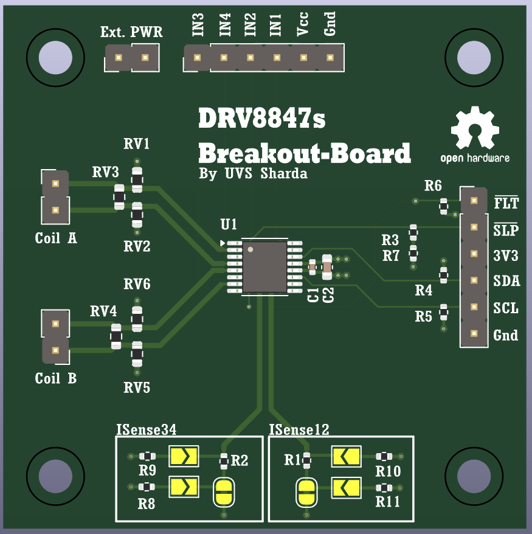

# DRV88447S-Breakout-Board
A DRV8847 Break-out Board for driving Stepper Motors, Brushed DC Motors and Solenoids. The motor supply voltage can be between 2.7V to 18V. Digital control signals at 3.3V,  allows indirect control through I2C or direct control through 4 GPIO inputs to the Dual H-bridges. Along with the KiCAD 8.0 Files, I have also included manufacturing files for JLCPCB. The PCB was succefully manufactered and SMT assembled by JLCPCB in December 2025.
## Kicad Render

## Credit
[Uday Vivek Singh SHARDA](https://www.linkedin.com/in/uday-vivek-singh-sharda-988475122/)  
EENG2 P2029 ECAM LaSalle Lyon
## License
Hardware design files in this repository are licensed under the CERN-OHL-P-2.0 license.
See the LICENSE file for full terms.
